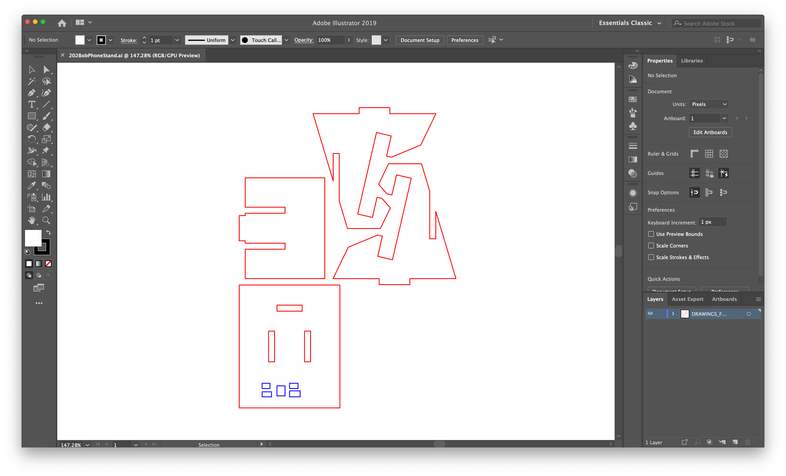

#Weekly Report 09/07/2023
## Bob Tianqi Wei, Technology Design Foundations

### Summary: 

In this week's TDF class, I continued to learn about using Figma, where we sign up for workshops on different topics, and Figma allows many of us to add content to a page at the same time due to its ability to collaborate online in real time. This is a very interesting tool as we can see everyone's mouse pointers when they are working and see what everyone is changing in real time as if they are working on my computer.

I signed up for a workshop at Jacobs Hall equipments and the instructor took us out to actually work with the laser cutting equipment and solved a problem one of my classmates was having: setting up the correct size in Illustrator to get a cell phone holder cut to the correct size when cutting it. I also learned about the ability to locate a specific position on a board in the laser cutter software, which is especially useful when we want to utilize a board that has already been used, allowing us to save material and make the best use of it.

</img> 
I added my name to the phone stand in illustrator.

</img>

I used a laser-cutting machine to create this phone stand. During the process, I learned how to adjust line width and line color to control the laser cutter's functionality effectively.

However, on the initial attempt, even with all parameters correctly set, the laser didn't cut through the wood entirely. I noticed that some classmates tried to remove the stand immediately after the first incomplete cut, which resulted in the wood splitting. So, I decided to recut it in the same location, and the result was very satisfying.

---

### Reflections:

</img>

During the laser-cutting assignment, I engraved my name, "Bob" (in an abstract form), on the bottom plate of the phone stand. However, I didn't consider the final assembly's effect, resulting in my name being obscured once it was put together. This was a hasty oversight in my design. In the future, I will be more thorough in my design considerations.

---

### Speculations:

In the upcoming weeks, I will diligently study the knowledge covered in the TDF course and strive to become proficient in using these tools to enhance my design work. This is also my first time using GitHub and markdown, and I believe these tools will be beneficial for me.

---
