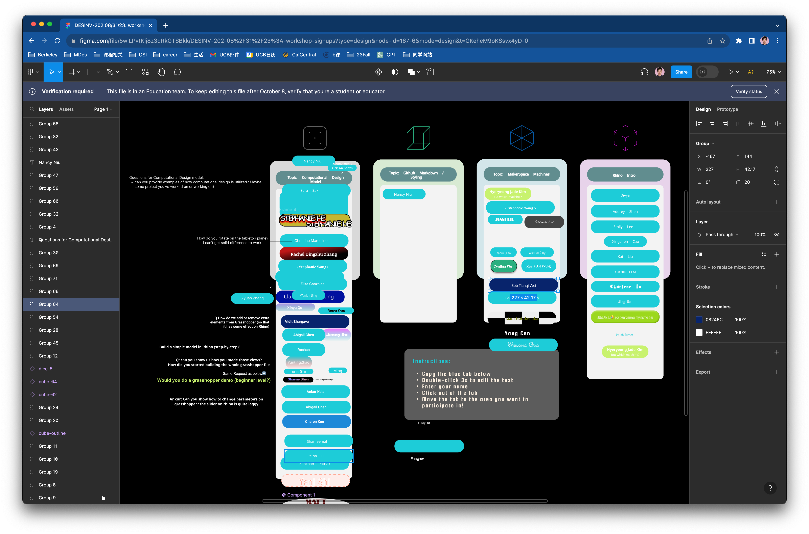
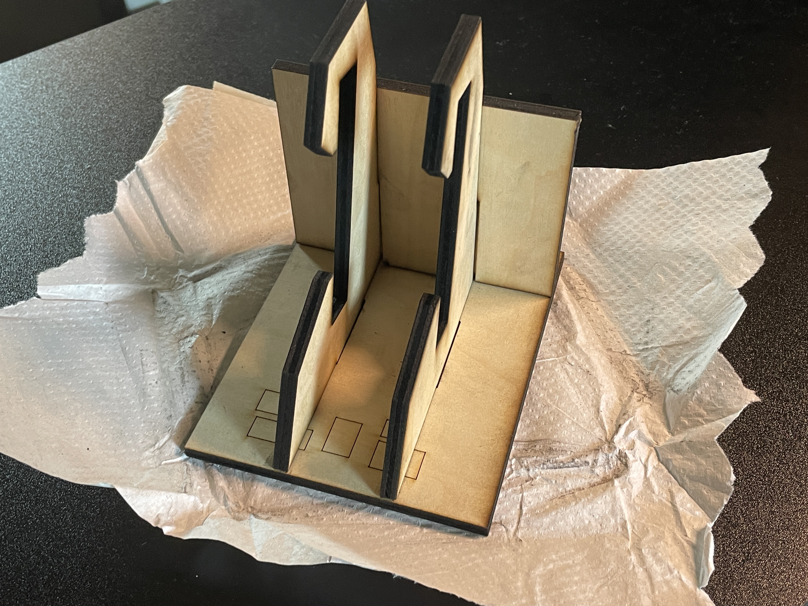

#Weekly Report 09/07/2023
## Bob Tianqi Wei, Technology Design Foundations

### Summary: 

In this week's TDF class, I continued to learn about using Figma, where we sign up for workshops on different topics, and Figma allows many of us to add content to a page at the same time due to its ability to collaborate online in real time. This is a very interesting tool as we can see everyone's mouse pointers when they are working and see what everyone is changing in real time as if they are working on my computer.

</img> 
It's funny because I don't know which one of my classmates always changes my name to a really weird font.

I signed up for a workshop at Jacobs Hall equipments and the instructor took us out to actually work with the laser cutting equipment and solved a problem one of my classmates was having: setting up the correct size in Illustrator to get a cell phone holder cut to the correct size when cutting it. I also learned about the ability to locate a specific position on a board in the laser cutter software, which is especially useful when we want to utilize a board that has already been used, allowing us to save material and make the best use of it.

</img>

---

### Reflections:

This week's lesson made me think about the tools I'm learning and using for those scenarios? Many of the tools we normally use such as online documents (Google, Microsoft, Kingsoft) have attributes such as online collaboration, but tools such as Figma and Miro are better suited to design as they can be displayed in real time and are more feature rich. But I also thought about whether Figma is suitable for all scenarios such as event registration, because if there are too many users, you don't know who did what and it can cause confusion.

---

### Speculations:

n the next few weeks, I will hopefully learn more about the tools in the TDF course and apply them to my future studies and work.

---
