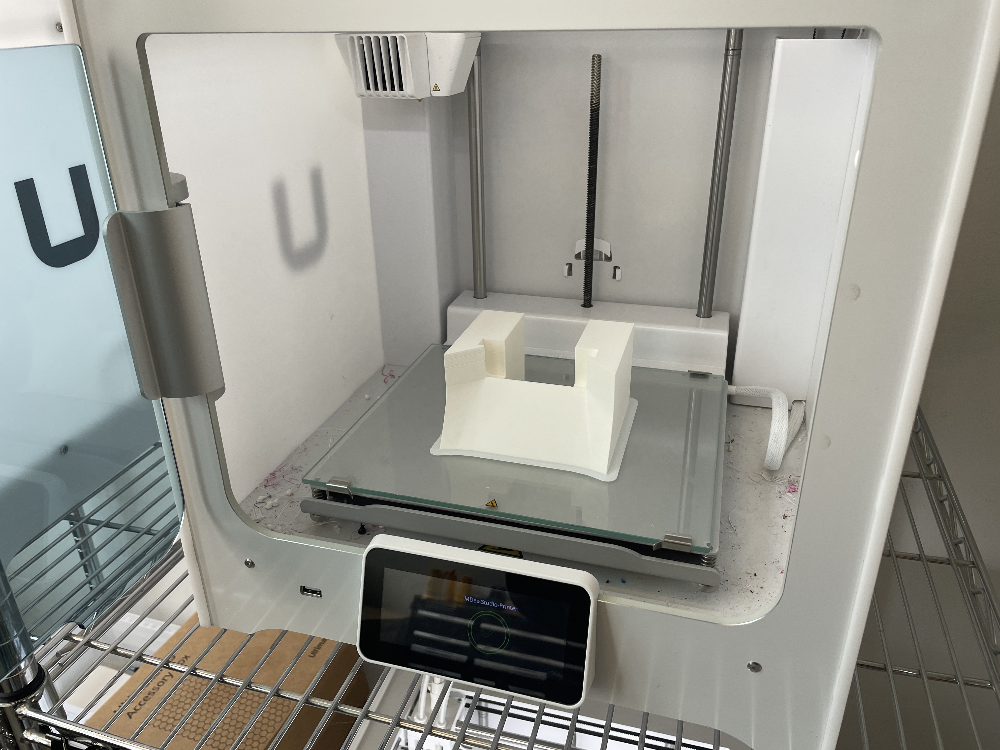

#Weekly Report 09/14/2023
## Bob Tianqi Wei, Technology Design Foundations

### Summary: 

In this week's TDF course, I learned the fundamentals of Grasshopper modeling very clearly. It's been a great start for me in grasping Grasshopper. With the knowledge I gained, I was able to create a new phone stand based on the files provided in the tutorial, tailored to my own needs, and 3D printed it. Moreover, during the process of making this phone stand, I identified areas in my design that needed improvement. It made me realize the importance of more careful consideration in my designs, as there are still some aspects of my phone stand that require refinement. This is what I have learned.

</img> 
We vote for content of interest in Figma.

</img> 
In class, I learned the basics of Grasshopper, and I encountered red-colored elements when I first started using Grasshopper. Later on, I realized that this was because I hadn't set the appropriate length units. If the length units are set correctly, all the modifications to the model will be successful.

</img>
I've started working on Project 1, which is a phone stand. I want to design a phone stand for use during video calls at home so that I don't have to hold my phone all the time. I'd like to place it on the table when making video calls. It's important that the phone stand doesn't have too much tilt, as I don't want to be too close to the phone to show my upper body properly. It's best if the phone stands almost vertically on the table so that my actions are clearly visible from anywhere in the room. Additionally, it's important that it can charge while in use. Lastly, I want the stand to match the style of my usage scenario, not look out of place, and have a unique appearance.

</img>
</img>
I first adjusted the angles in Grasshopper to meet these criteria for the phone stand to match my requirements.
</img>
</img>
</img>
</img>

Later, I started experimenting with some new elements. I wanted to use two new rectangular shapes to cut and create the phone stand. This way, they would have a very distinctive artificial look, which aligns with my aesthetic preferences. I adjusted the proportions of the model to make it look comfortable and ensured there were no flat surfaces on the front. This was important because if I simply connected the cubes, there would be two flat surfaces at the corners, which wouldn't look good. After that, I used another smaller rectangular shape to cut a portion of the larger one, creating space for the charging cable and ensuring the speaker's sound could be heard. Now, it's ready for 3D printing.

</img>
</img>

I imported the model into the 3D printer at the second floor of Jacobs Hall, specifically the Ultimaker. I set up the parameters and filled in the texture on the computer and started the printing process. The model took a total of 12 hours to print, and the next morning, I went to collect my phone stand model.

</img>
</img>
The angle of this stand perfectly meets my requirements for video calls. I can be quite far from the camera and still see my entire upper body in the frame.
</img>
However, the stand's width is too large for my phone because I didn't measure my phone's width accurately when making it.
</img>
</img>
There is space at the bottom for the charger and speaker, so I can charge my phone while using the stand, and the speaker's sound won't be blocked.
Additionally, this phone stand has a unique and angular appearance that fits well with my desktop.

<iframe width="560" height="315" src="https://www.youtube.com/embed/u4n6DXx9_as?si=lO_rcJo5uUrZJruK" title="YouTube video player" frameborder="0" allow="accelerometer; autoplay; clipboard-write; encrypted-media; gyroscope; picture-in-picture; web-share" allowfullscreen></iframe>

Video:
https://youtu.be/u4n6DXx9_as

---

### Reflections:

This week's assignment taught me that I should consider more attention to detail in my designs, such as whether the precise dimensions are appropriate, as having the right dimensions can save a lot of additional improvement work. Additionally, we should thoroughly imagine what it will look like after it's implemented when designing.

---

### Speculations:

I will continue to refine this model to make it more suitable for my phone's dimensions and create an improved version of the model. This week was a great start to my learning journey with Grasshopper, and I believe Grasshopper is a very useful tool.
---
