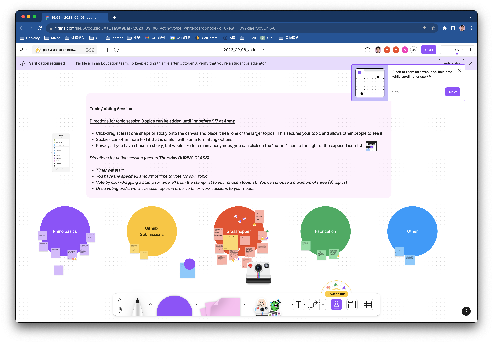

#Weekly Report 09/14/2023
## Bob Tianqi Wei, Technology Design Foundations

### Summary: 

In this week's TDF course, I learned the fundamentals of Grasshopper modeling very clearly. It's been a great start for me in grasping Grasshopper. With the knowledge I gained, I was able to create a new phone stand based on the files provided in the tutorial, tailored to my own needs, and 3D printed it. Moreover, during the process of making this phone stand, I identified areas in my design that needed improvement. It made me realize the importance of more careful consideration in my designs, as there are still some aspects of my phone stand that require refinement. This is what I have learned.

</img> 
We vote for content of interest in Figma.

</img> 
In class, I learned the basics of Grasshopper, and I encountered red-colored elements when I first started using Grasshopper. Later on, I realized that this was because I hadn't set the appropriate length units. If the length units are set correctly, all the modifications to the model will be successful.

</img>
I've started working on Project 1, which is a phone stand. I want to design a phone stand for use during video calls at home so that I don't have to hold my phone all the time. I'd like to place it on the table when making video calls. It's important that the phone stand doesn't have too much tilt, as I don't want to be too close to the phone to show my upper body properly. It's best if the phone stands almost vertically on the table so that my actions are clearly visible from anywhere in the room. Additionally, it's important that it can charge while in use. Lastly, I want the stand to match the style of my usage scenario, not look out of place, and have a unique appearance.

</img>
</img>
I first adjusted the angles in Grasshopper to meet these criteria for the phone stand to match my requirements.
</img>
</img>
</img>
</img>

Later, I started experimenting with some new elements. I wanted to use two new rectangular shapes to cut and create the phone stand. This way, they would have a very distinctive artificial look, which aligns with my aesthetic preferences. I adjusted the proportions of the model to make it look comfortable and ensured there were no flat surfaces on the front. This was important because if I simply connected the cubes, there would be two flat surfaces at the corners, which wouldn't look good. After that, I used another smaller rectangular shape to cut a portion of the larger one, creating space for the charging cable and ensuring the speaker's sound could be heard. Now, it's ready for 3D printing.

</img>
</img>

I imported the model into the 3D printer at the second floor of Jacobs Hall, specifically the Ultimaker. I set up the parameters and filled in the texture on the computer and started the printing process. The model took a total of 12 hours to print, and the next morning, I went to collect my phone stand model.

</img>
</img>
</img>
</img>
</img>

---

### Reflections:

This week's lesson made me think about the tools I'm learning and using for those scenarios? Many of the tools we normally use such as online documents (Google, Microsoft, Kingsoft) have attributes such as online collaboration, but tools such as Figma and Miro are better suited to design as they can be displayed in real time and are more feature rich. But I also thought about whether Figma is suitable for all scenarios such as event registration, because if there are too many users, you don't know who did what and it can cause confusion.

---

### Speculations:

n the next few weeks, I will hopefully learn more about the tools in the TDF course and apply them to my future studies and work.

---
