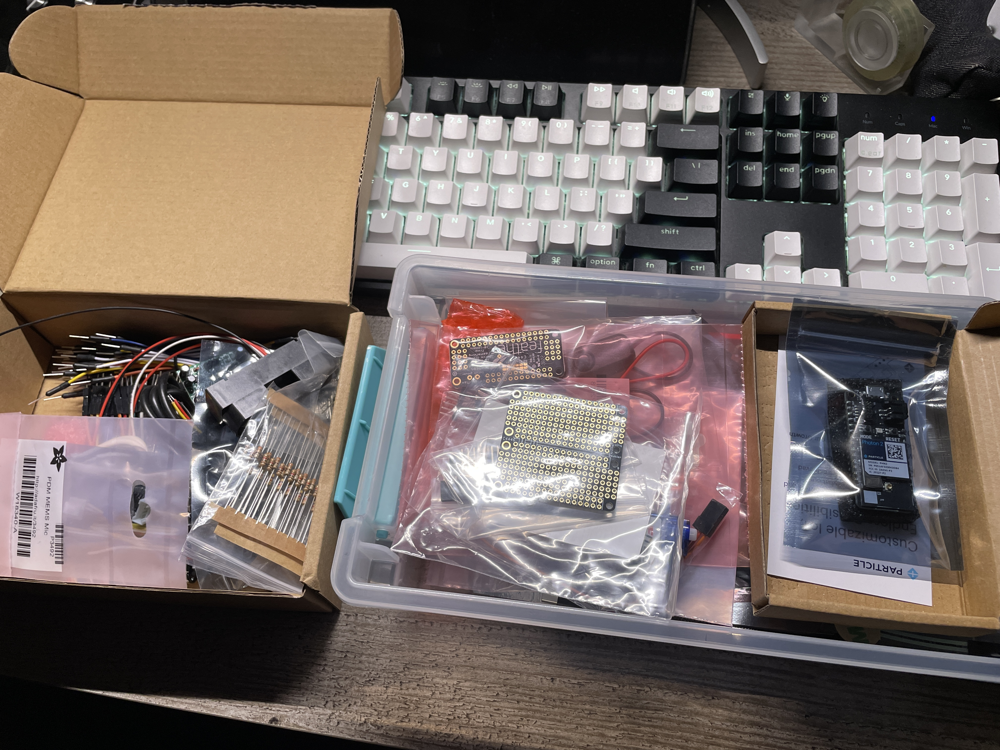
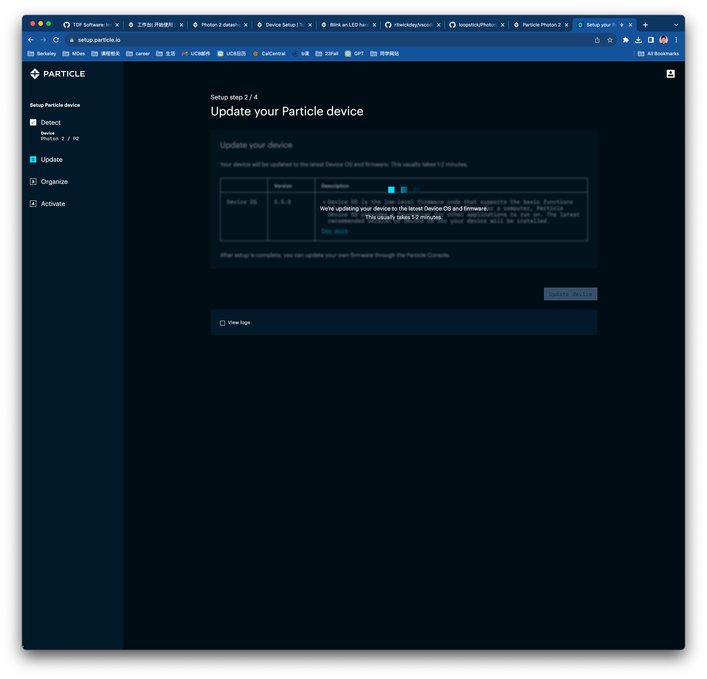
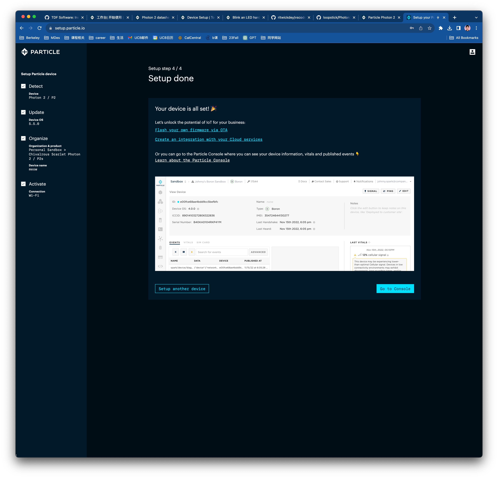
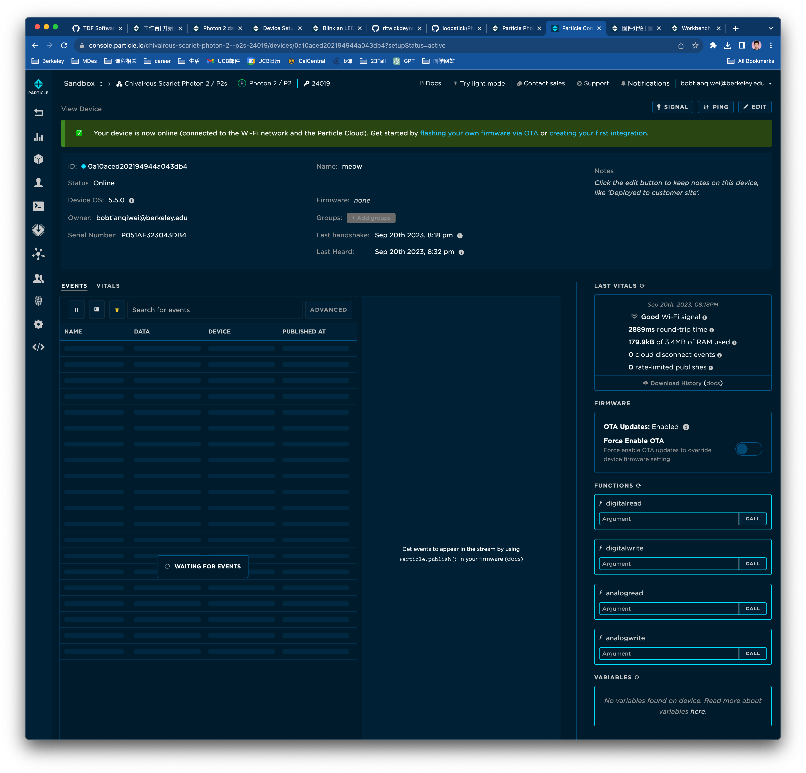
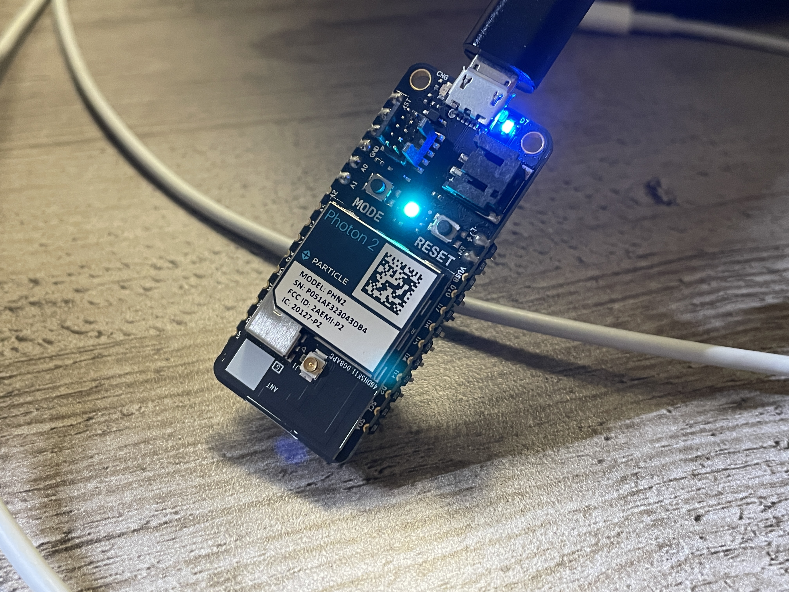
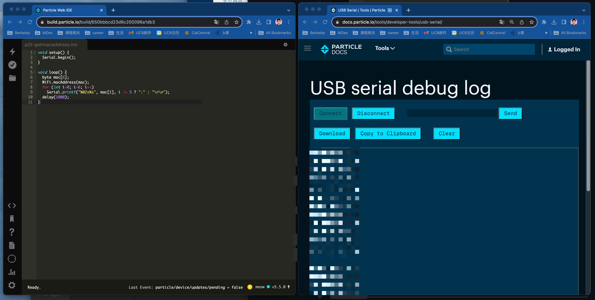
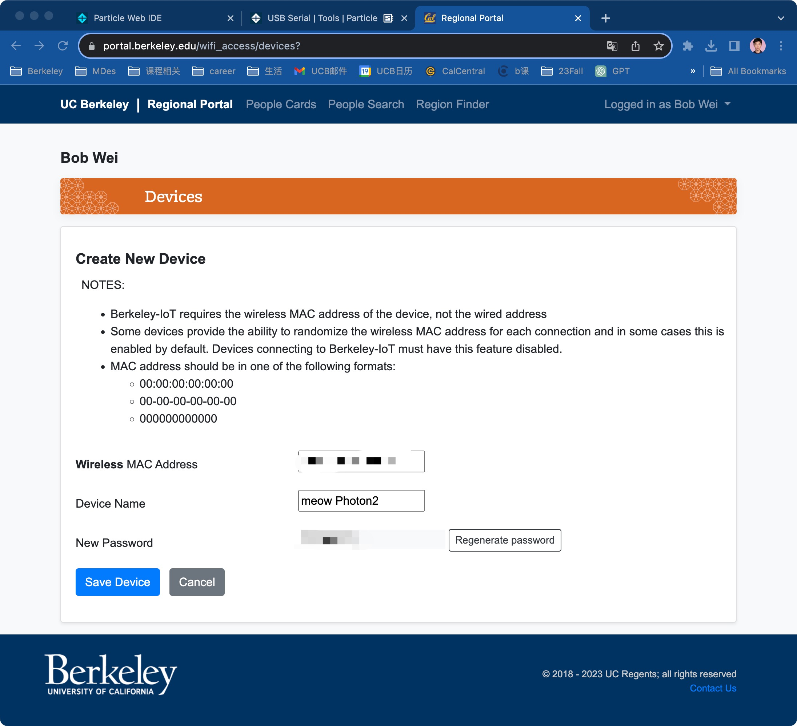
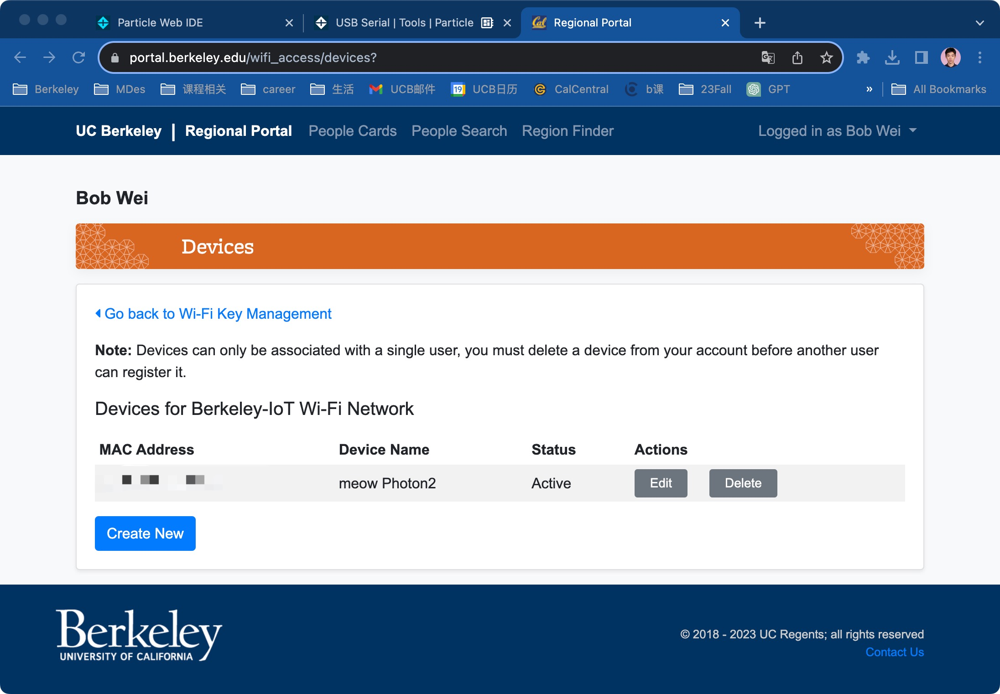
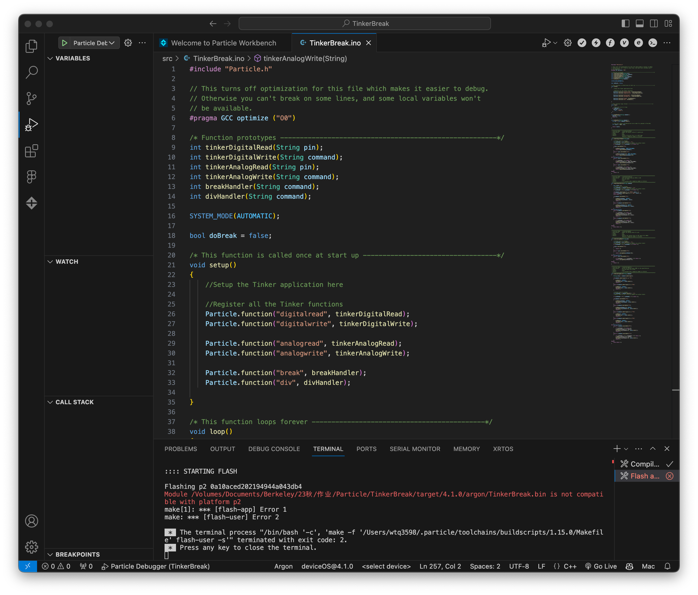

#Weekly Report 09/20/2023
## Bob Tianqi Wei, Technology Design Foundations

### Summary: 

After last Thursday's course, I received feedback and comments from many of my students about my Project1 phone stand, and I followed the feedback to improve the way I explained my Project1 in the PDF document. This Monday we were given a new microcontroller for the TDF course, the Particle Photon2, and I followed the tutorial written by the instructor to set up the microcontroller, connect it to my home Wi-Fi, get the mac address and add the Berkeley IoT device.

</img> 
I got this open source hardware!

</img> 
</img> 
I started following tutorials to get started with Photon.
</img> 
Connected to Wi-Fi!
</img> 
Lights on this microcontroller!
</img> 
</img> 
I got the mac address!
</img> 
</img> 
I created the Berkeley IoT device! Already ready for Thursday's class!
</img> 
When I try to run a code following the tutorial in workbench, I get an error message that I can't fix, and I don't know what it is.

---

### Reflections:

I thought Photon is a microcontroller like Arduino and when I tried to operate it directly, it showed a lot of error messages in terminal which I didn't know how to solve. There are times when you can't be blindly confident just because you have similar experience, it's better to follow the tutorials step by step.

---

### Speculations:

This open source hardware set I got for this class has a lot of really interesting sensors in it, and I'm really looking forward to making interesting things for future classes!
---
