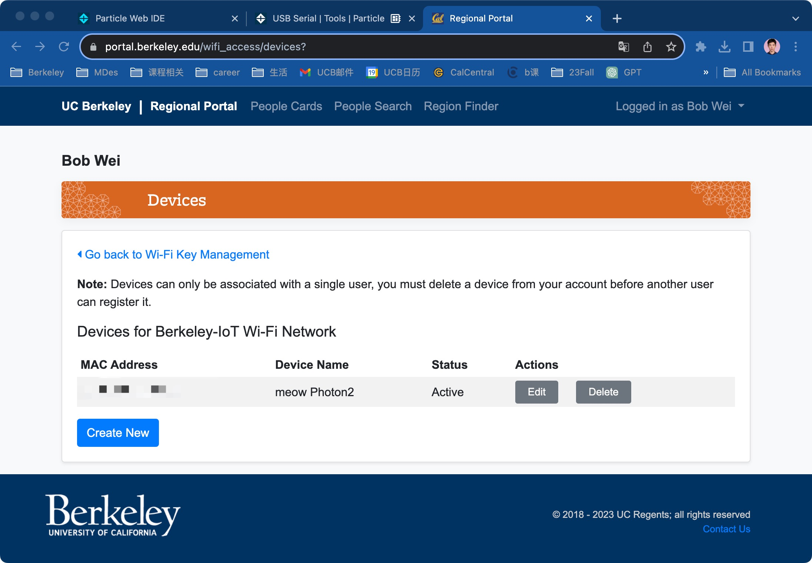
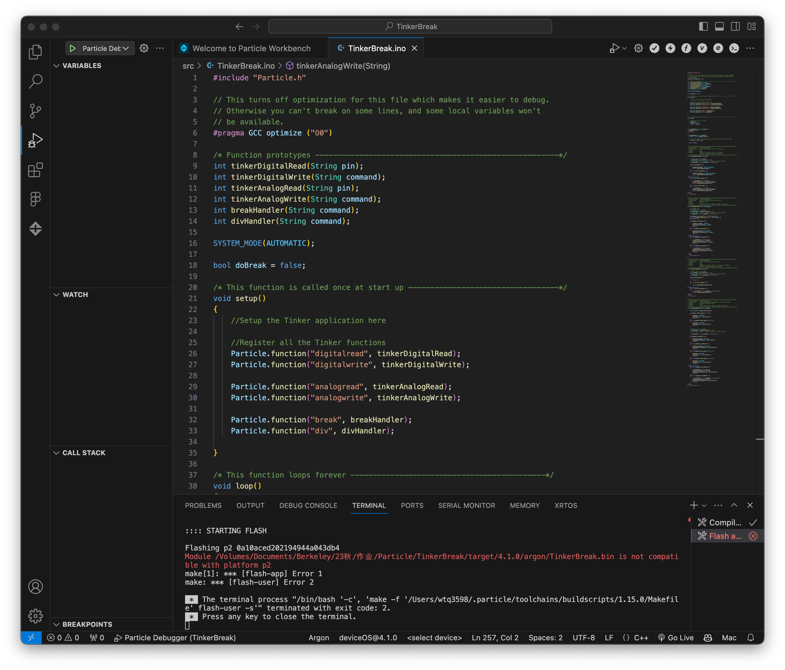

#Weekly Report 09/25/2023
## Bob Tianqi Wei, Technology Design Foundations

### Summary: 

In Thursday's TDF class, I was guided by the instructor to set up the Photon 2 to connect to Berkeley IoT's Wi-Fi and run simple programs: using serial and lighting up small lights. This got me introduced to the microcontroller and ready to continue using it to make more fun things in the future. In Monday's session, we were divided into groups and I brainstormed with my group members and we discussed solutions based on the topic of mobility. In the second half of the classlecture, one of the speakers described the experience of making some musical instruments using special materials and Arduino, which was very inspiring for me. The use of conductive materials, fabric and paper was very interesting.

</img> 
My Photon 2 is connected to the Berkeley IoT network!

</img> 
I successfully ran hello world in the online IDE and saw the text I changed in the serial monitor!

</img> 

</img> 
</img> 
I got the mac address!
</img> 
</img> 
I created the Berkeley IoT device! Already ready for Thursday's class!
</img> 
When I try to run a code following the tutorial in workbench, I get an error message that I can't fix, and I don't know what it is.

---

### Reflections:

I thought Photon is a microcontroller like Arduino and when I tried to operate it directly, it showed a lot of error messages in terminal which I didn't know how to solve. There are times when you can't be blindly confident just because you have similar experience, it's better to follow the tutorials step by step.

---

### Speculations:

This open source hardware set I got for this class has a lot of really interesting sensors in it, and I'm really looking forward to making interesting things for future classes!
---
