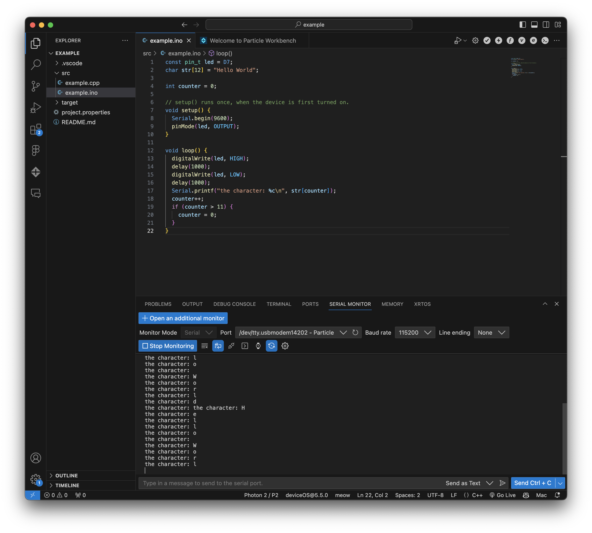
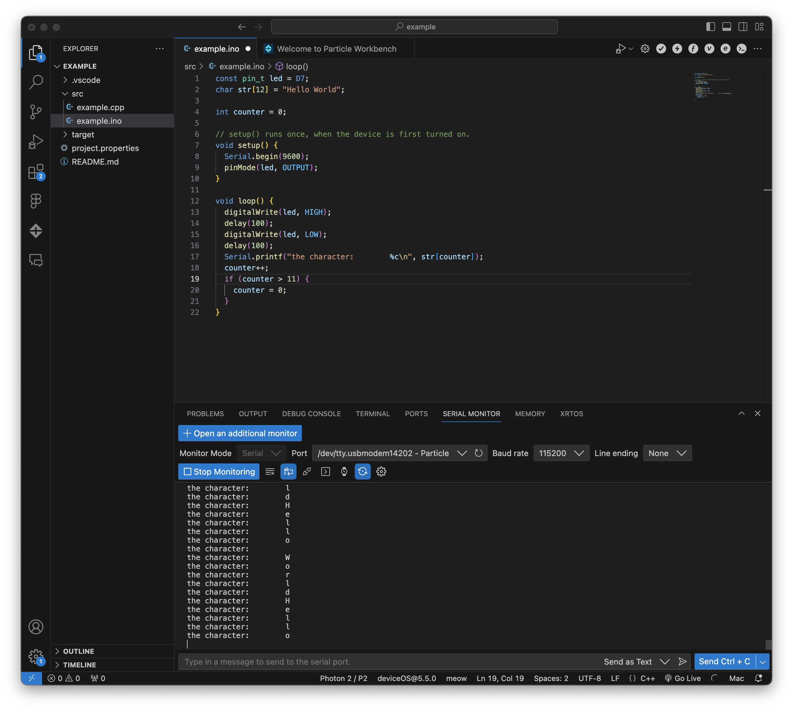
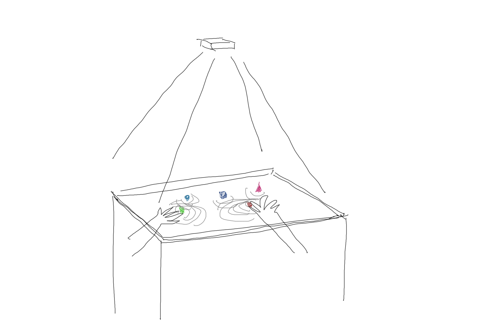

#Weekly Report 10/04/2023
## Bob Tianqi Wei, Technology Design Foundations

### Summary: 

In this week's TDF class, I connected my Photon microcontroller to the computer and successfully controlled the Photon with VS Code. i have never been able to do this before, but this week following the tutorials in the instructor's class I was able to do it.

After class, I also discussed our Project 2 with my group members.

</img> 
My Photon flashed the code!

</img> 
This hello world always has one more line.

</img> 
I changed the code and now it works.

</img> 
I also finished my Project 2 grouping and had 3 group discussions. Here is my sketch for our initial idea.

---

### Reflections:

It's important to have a unified opinion among the group.

---

### Speculations:

I hope I can do well with Project2.
---
