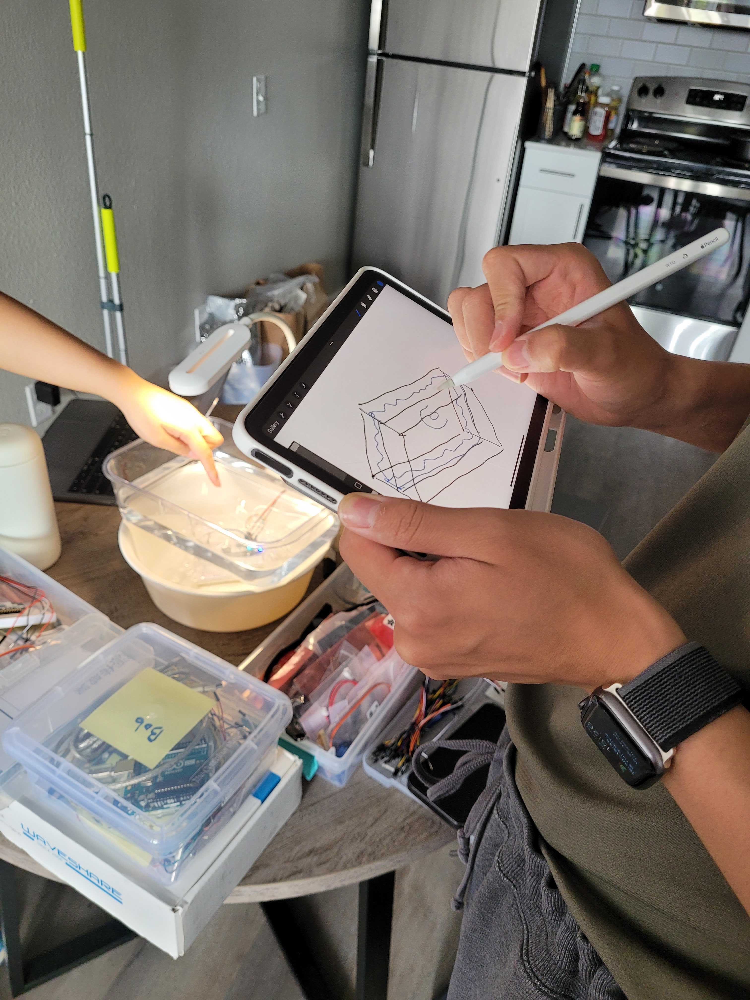
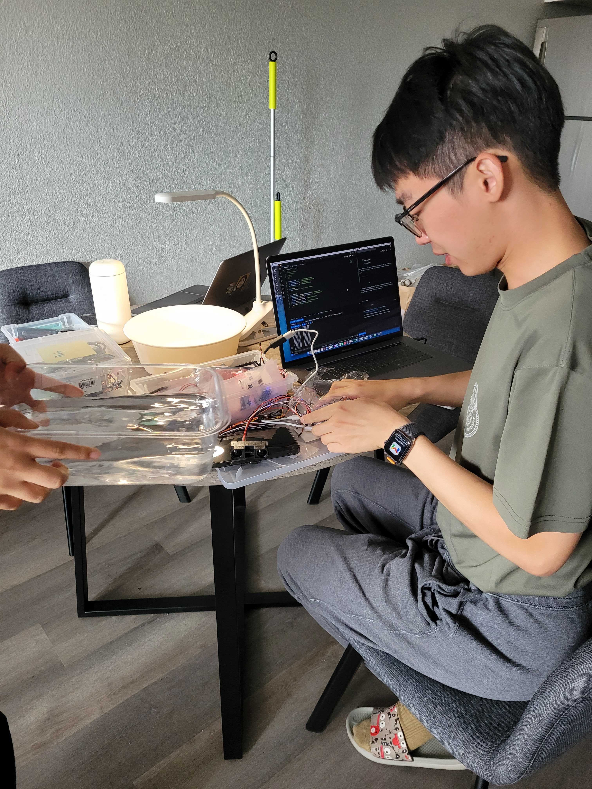
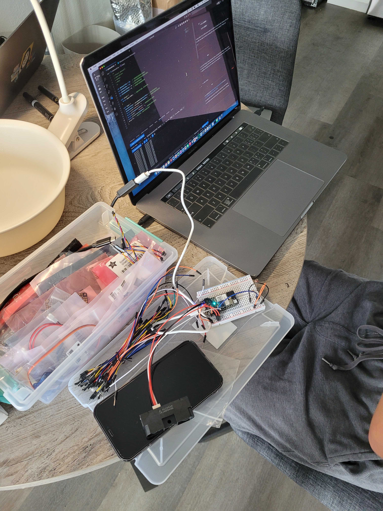
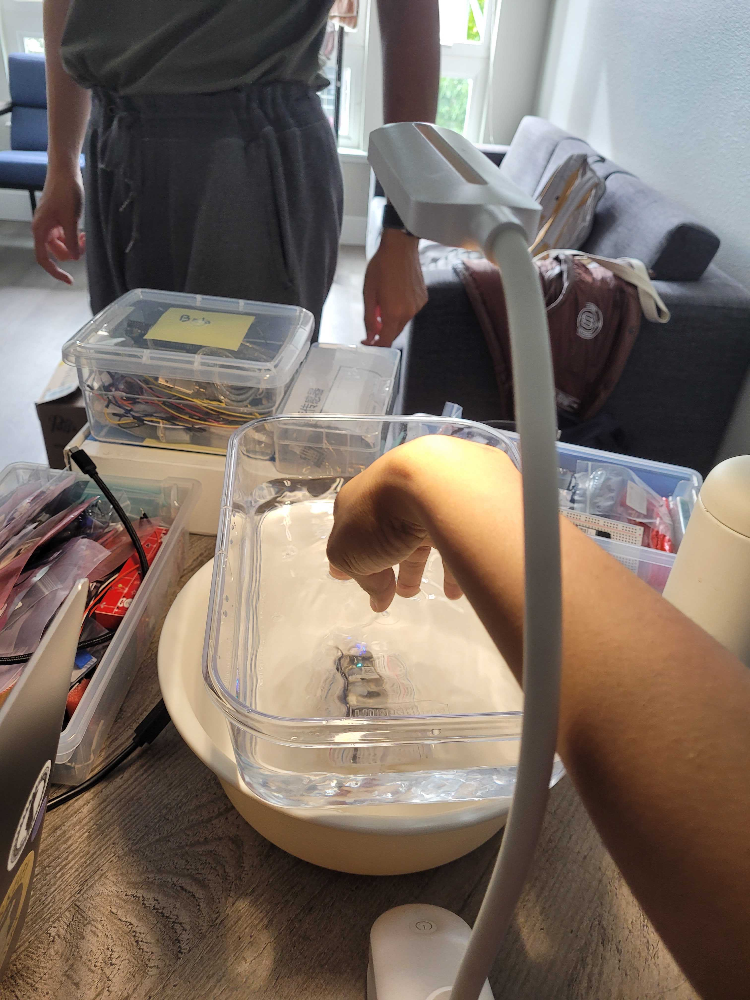

#Weekly Report 10/12/2023
## Bob Tianqi Wei, Technology Design Foundations

### Summary: 

This past week, my groupmates and I have been making great progress on the Project2 musical installation. We discussed the form of the installation and made our very first attempts using water, microcontrollers, and photoresistors and distance sensors. I led the whole group in this week's experiment and wrote all the code and built the circuit. We also made drawings of the enclosure for the device and plan to laser cut acrylic panels and glue them together.

I'm very happy to see our project progressing.

</img> 
</img> 
</img> 
</img> 
</img> 

---

### Reflections:

You should be extra careful when working with electronics and water, the last time water spilled on my microcontroller.

---

### Speculations:

I am very much looking forward to discussing my project and making more progress with my professors in class and in Office hour.
---
