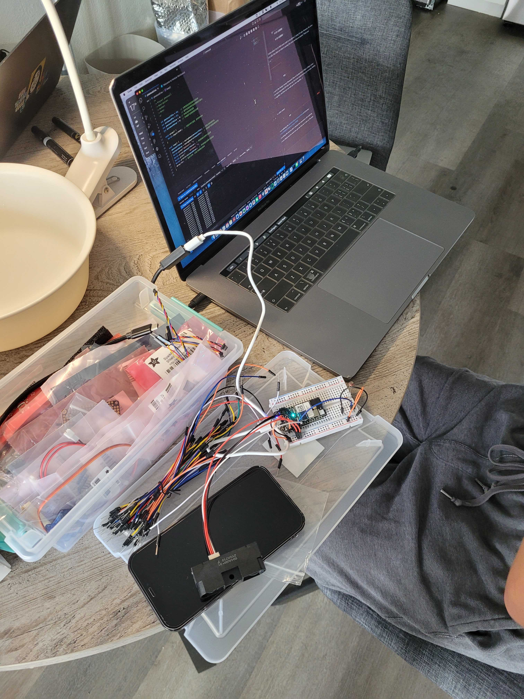

#Weekly Report 10/18/2023
## Bob Tianqi Wei, Technology Design Foundations

### Summary: 

During the week, we finished our Project2.Since I was traveling to Pittsburgh for an academic conference Wednesday through Friday, we finished most of the device and code over the weekend. We made the tank out of laser cut acrylic panels. Two Photon microcontrollers were used to send the information from the sensors to the computer. One of the Main Photon was connected to four photoresistors, which changed value when we played with the water and waves appeared on the water surface. The values of these four photoresistors are mapped to volume, delay, reverb, and pan effects.The Main Photon also receives data. Another Photon has an ultrasonic distance sensor attached to it, sending data from this ultrasonic distance sensor to the main Photon. The ultrasonic distance sensor turns on the delay effector when it detects a hand inside the tank, otherwise it turns it off.

</img> 
</img> 
</img> 
</img> 
</img> 

---

### Reflections:

You should be extra careful when working with electronics and water, the last time water spilled on my microcontroller.

---

### Speculations:

I am very much looking forward to discussing my project and making more progress with my professors in class and in Office hour.
---
