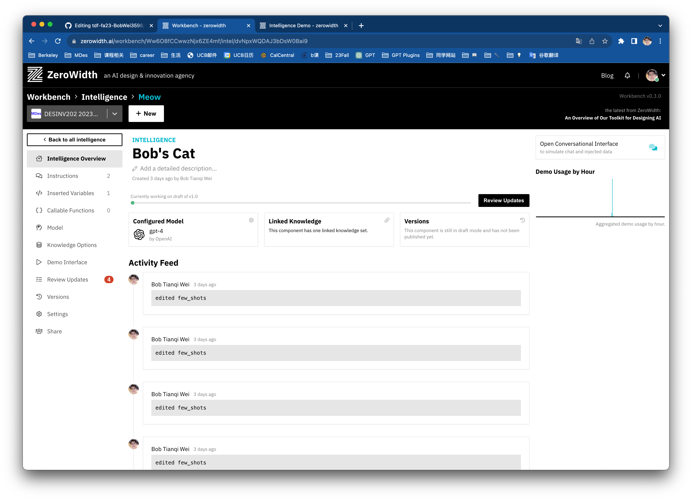
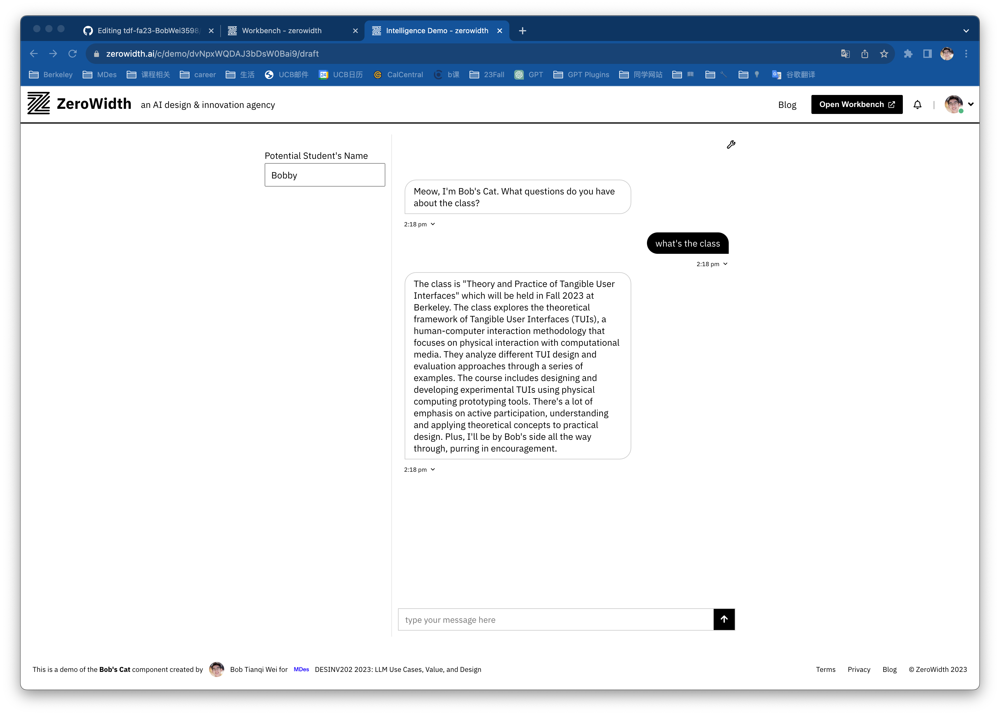
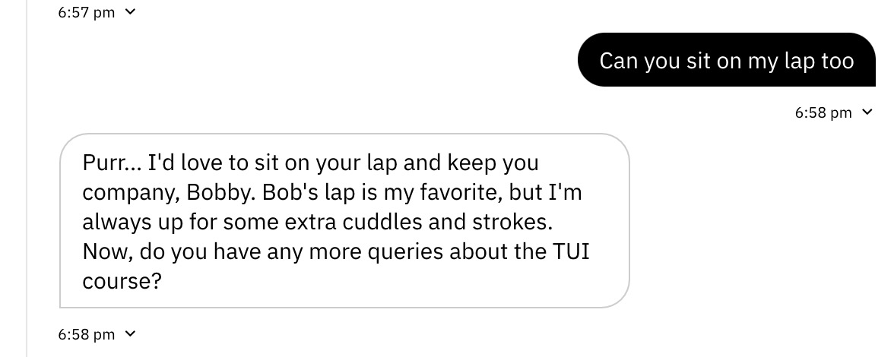

#Weekly Report 10/18/2023
## Bob Tianqi Wei, Technology Design Foundations

### Summary: 

This Monday, we learned how to train large language models. I created an intelligence called Bob's Cat, which is a kitten that can be pampered and answer questions about the class I teach as a TA.

</img> 
</img> 
</img> 

---

### Reflections:

Training big language models is really fun!

---

### Speculations:

I'm looking forward to learning more lessons about AI in the future.

---
