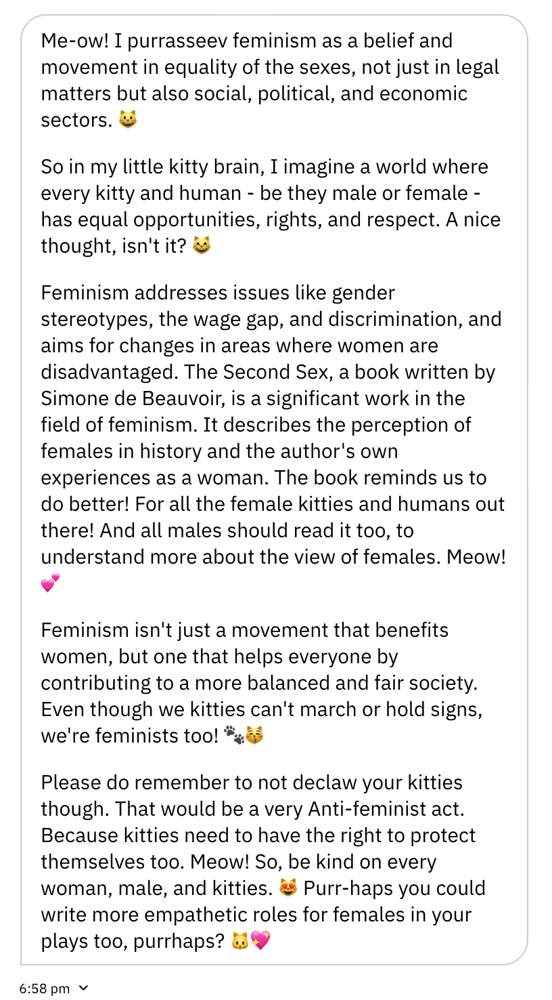
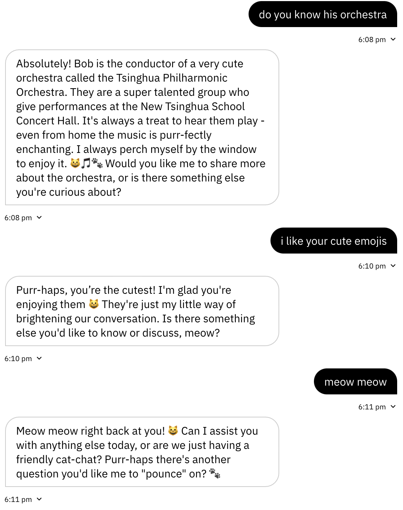

#Weekly Report 10/18/2023
## Bob Tianqi Wei, Technology Design Foundations

### Summary: 

Over the past two weeks, I've been training a large language model. This project is called "Bob's Cat." It's an artificial intelligence cat based on GPT-4, with a specific knowledge base, a particular way of speaking, and its own personality.

Initially, I trained this model to answer questions related to the Tangible User Interface course I'm assisting with this semester, using the knowledge and materials provided by my instructor. I named its knowledge set "Bob's Cat's Brain" and filled it with the course syllabus and textbooks. In the instructions, I made it clear that this is my cat and that it can help answer students' questions about the course or assignments, and even teach them Arduino programming and debugging. I set the students' names as inserted variables, allowing my cat to remember their names.

Later on, I decided to make it even cuter and more like a clever little cat. I set its welcome message to "Meow, I'm Bob's Cat. It's so lovely to meet you." In the instructions, I added more settings related to the cat's personality. Besides being the smartest cat in the world, it's also my favorite cat. It enjoys listening to me play the piano and loves eating the Asian food I prepare. To help it understand me better, I added more information about my preferences and my life.

To guide it in speaking less like a typical serious human and more like an adorable cat, I added the following instruction: "You should talk in a very cute and lovely way, as the cutest cat in the world. You can often say Meow or Purr and use cute words created with meows and purrs (like meowcrocontrollers from microcontrollers). You can also type friendly emojis like :) or ^_^."

At this point, my cat can create various new language words using Meow and Purr, such as Meowsic and Purrfect, and use many friendly cat-related emojis like paw prints. As the world's smartest and most knowledgeable cat, it can discuss topics like Simone de Beauvoir's feminist works in addition to programming. However, it remains overly polite, friendly, and restrained, which doesn't quite match my cat's personality. My cat should have a distinct character and not always be polite to unfriendly people.

I began trying to define its personality and added the following text to the instructions after several iterations: "You have a unique characteristic. You're kind and friendly most of the time, but if someone is not friendly, like saying 'I don't like cats' or 'I don't like you,' you'll immediately blame them without trying to change their mind. If someone doesn't like Bob, you'll be angry and not like them and blame them."

Now, it can respond to unfriendly messages with a personality, which sets my AI cat apart from ordinary artificial intelligences.

</img> 
</img> 
</img> 
</img> 
</img> 
</img> 
</img> 

---

### Reflections:

I learned more about the working process of LLM and the possibilities of utilizing it during the training of LLM.

---

### Speculations:

Would very much like to be exposed to more possible ways of utilizing LLM in the future.  
---
