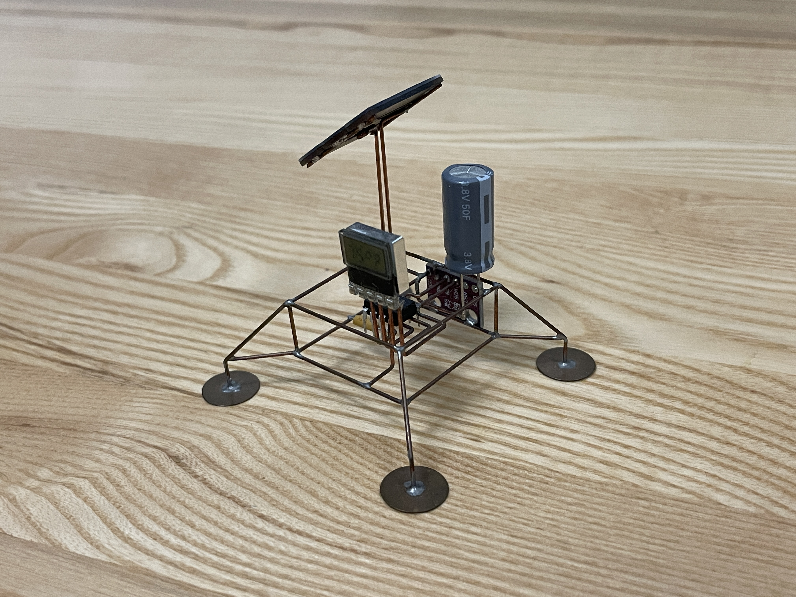
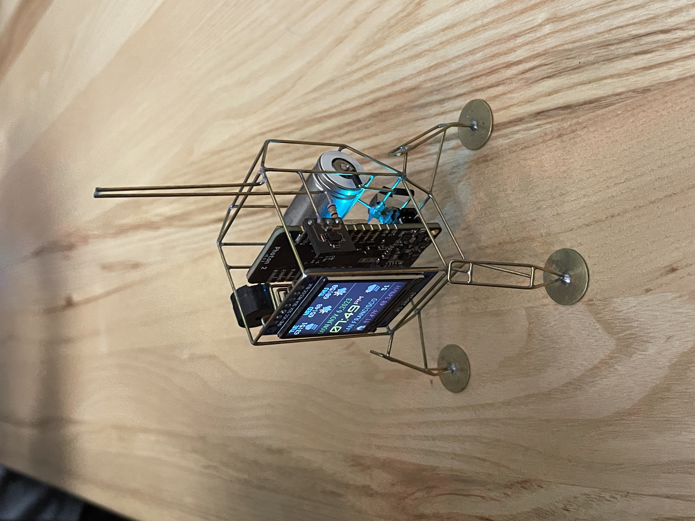

#Weekly Report 11/8/2023
## Bob Tianqi Wei, Technology Design Foundations

### Summary: 

This past Thursday, I delivered the final video for Project3 and received a lot of feedback from my students, which was very helpful!

On this Monday, the teacher explained the requirements for Project4. I started thinking about my Project4.

On Monday, one of the speakers who came to the lecture presented a small device he made with metal welding, which was very interesting and elaborate, and provided me with a lot of inspiration.

</img> 
</img> 

---

### Reflections:

I gained more presentation skills from the feedback from my classmates.

---

### Speculations:

I hope I can do well with Project4!
---

